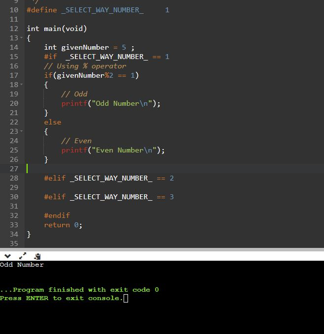
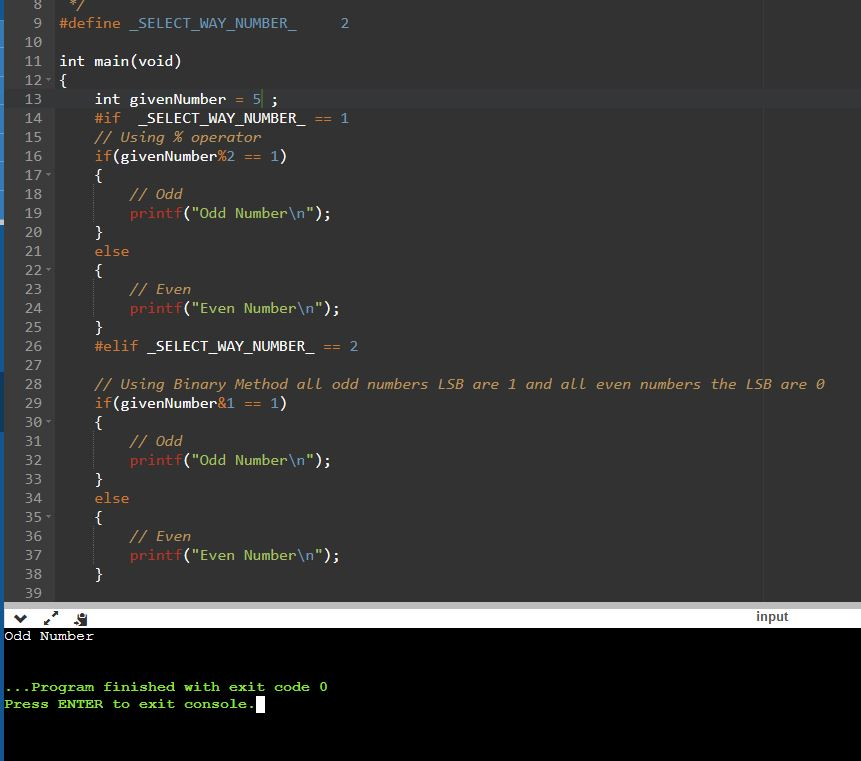
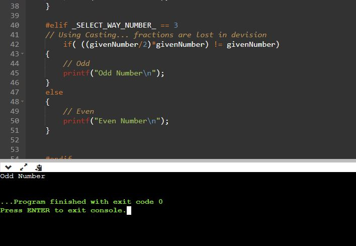

# TASK1.2

## Q:  mention 3 ways to know if a specific number is even or odd.

### 1. Using `%` Operator 
if the result = 0 so it is even otherwise is odd.

```C
    givenNumber = 5 ;
	if(givenNumber%2 == 1)
	{
		// Odd
		printf("Odd Number\n");
	}
	else
	{
		// Even 
		printf("Even Number\n");
	}
```

Result 

  


### 2. Using Binary Method
Using Binary Method all odd numbers LSB are 1 and all even numbers the LSB are 0
```C
    givenNumber = 5 ;
	if(givenNumber&1 == 1)
	{
		// Odd
		printf("Odd Number\n");
	}
	else
	{
		// Even 
		printf("Even Number\n");
	}
```

Result 

  

 ### 3. Using Implicit Casting
Using Casting... fractions are lost in devision
```C
    givenNumber = 5 ;
	if(((givenNumber/2)*givenNumber) != givenNumber)
	{
		// Odd
		printf("Odd Number\n");
	}
	else
	{
		// Even 
		printf("Even Number\n");
	}
```

Result 

  

 ## *Contributing*  
Bug reports, feature requests, and so on are always welcome. Feel free to leave a note in the Issues section.