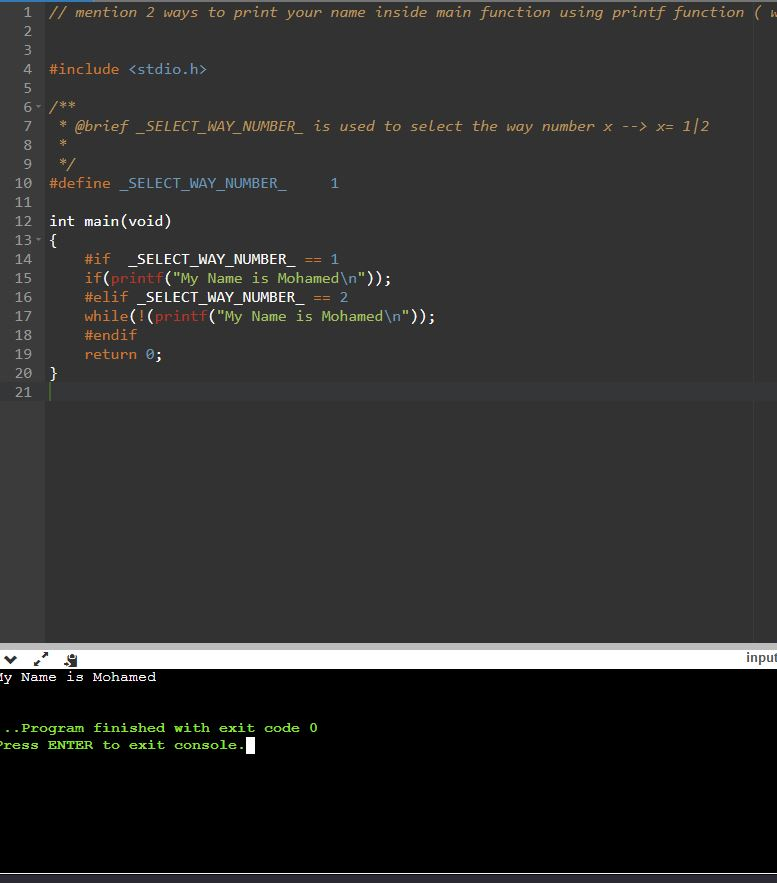
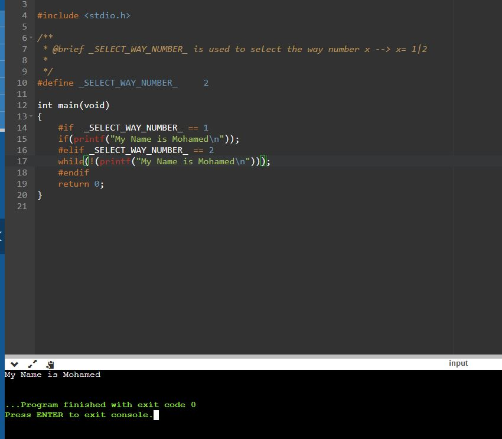

# TASK1.3

## Q:  mention 2 ways to print your name inside main function using printf function ( without writing ; at the end of this line )

### 1. Using `IF` Operator 

```C
if( printf("My Name is Mohamed\n") ); 
```

Result 

  


### 2. Using WHILE
```C
while( !(printf("My Name is Mohamed\n")) ); 
```

Result 

  


 ## *Contributing*  
Bug reports, feature requests, and so on are always welcome. Feel free to leave a note in the Issues section.