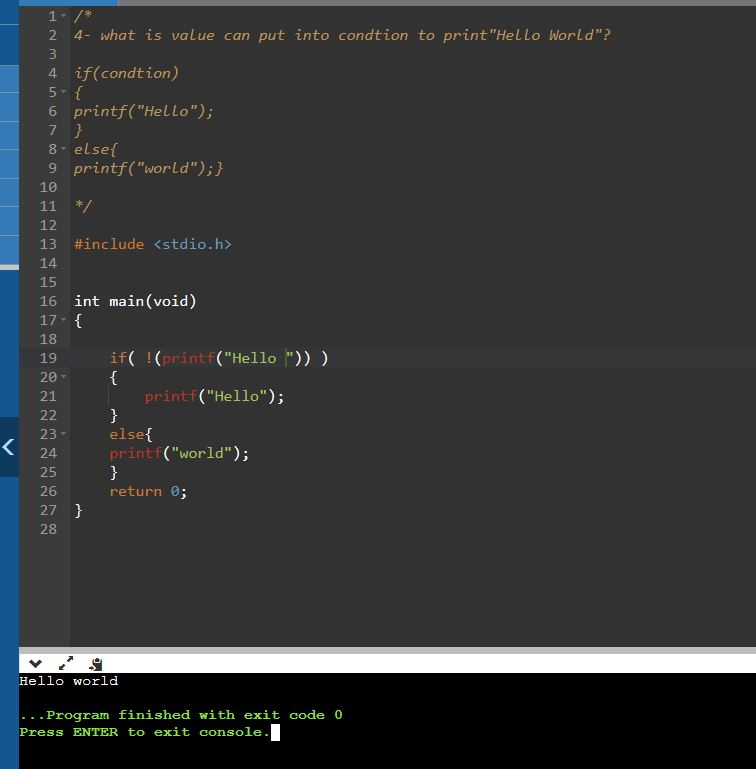

# TASK1.3

## Q:  what is value can put into condtion to print"Hello World"?
```C
if(condtion)
{
    printf("Hello");
}
else
{
    printf("world");
}
```

### 1. Using `printf` instead of condition and make `!` for number of char returned from `printf`
```C
if( !( printf("Hello") ) ) 
{
    printf("Hello");
}
else
{
    printf("world");
}
```

Result 

  


 ## *Contributing*  
Bug reports, feature requests, and so on are always welcome. Feel free to leave a note in the Issues section.