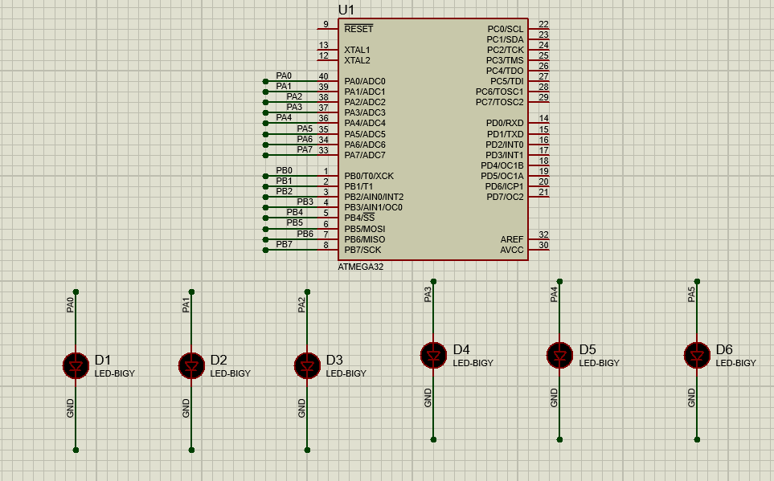
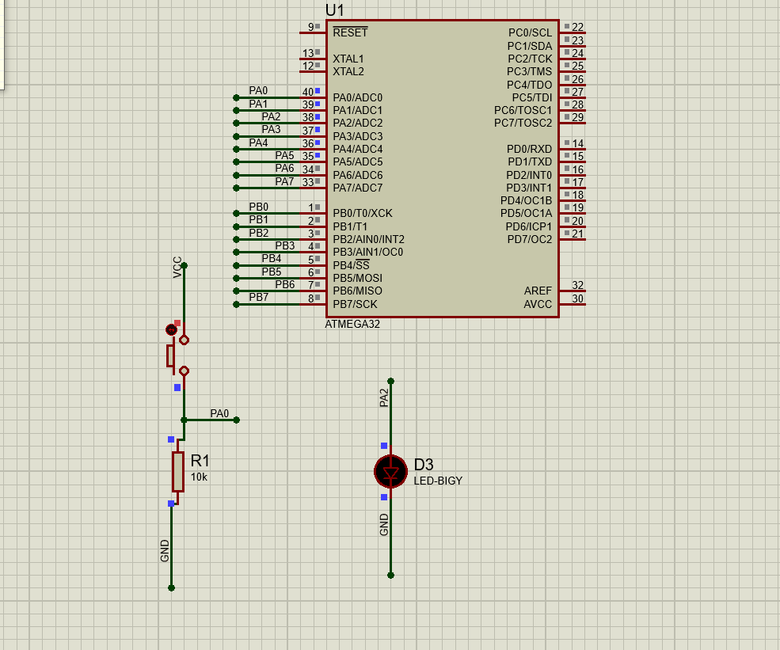
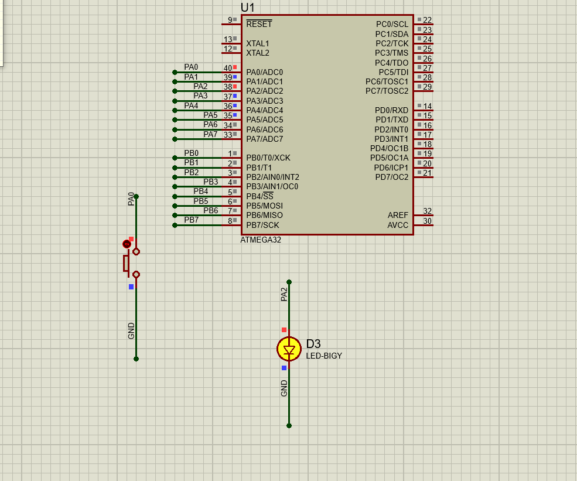

# Interfacing - DIO 

## Q1:  Complete the function Named `dio_vidWriteChannelGroup()` 

### Example 
```C
int main(void)
{
	// PINA2 Output
	dio_vidConfigChannel(DIO_PORTA,DIO_PIN2,OUTPUT);
	// Port Group
	dio_vidConfigChannel(DIO_PORTA,DIO_PIN0,OUTPUT);
	dio_vidConfigChannel(DIO_PORTA,DIO_PIN1,OUTPUT);
	dio_vidConfigChannel(DIO_PORTA,DIO_PIN3,OUTPUT);	
	dio_vidConfigChannel(DIO_PORTA,DIO_PIN4,OUTPUT);
	dio_vidConfigChannel(DIO_PORTA,DIO_PIN5,OUTPUT);
	
	// PINA2 HIGH
	dio_vidWriteChannel(DIO_PORTA,DIO_PIN2, STD_HIGH);
	
	// Group Mask
	// Turn On PINA0,A1,A5 
	// Turn Off PINA3,A4
	dio_vidWriteChannelGroup(DIO_PORTA ,(1<<DIO_PIN0) |
										(1<<DIO_PIN1) |
										(1<<DIO_PIN3) |
										(1<<DIO_PIN4) |
										(1<<DIO_PIN5) 
										,0b00100011); // Mask will be 0bxx100x11
	 
     while (1) 
    {
		dio_vidFlipChannel(DIO_PORTA,DIO_PIN2); 
		// Every 100 ms
		_delay_ms(100);
		
    }
}

```
Result 

  

 ## Q2:  Complete the function Named `dio_dioLevelReadChannel()` 

### Example 
```C
int main(void)
{
	// PINA2 Output
	dio_vidConfigChannel(DIO_PORTA,DIO_PIN2,OUTPUT);
	
	// PINA0 Input
	dio_vidConfigChannel(DIO_PORTA,DIO_PIN0,INPUT);
	
	// PINA2 HIGH
	dio_vidWriteChannel(DIO_PORTA,DIO_PIN2, STD_HIGH);

    while (1) 
    {
		// Externally Pulled Down
		if(dio_dioLevelReadChannel(DIO_PORTA,DIO_PIN0) == STD_HIGH)
			dio_vidFlipChannel(DIO_PORTA,DIO_PIN2); 
		// Every 10 ms
		_delay_ms(10);
		
    }
}
```
Result 

  


 ## Q3:  Complete the function Named `dio_vidEnablePullUp()` 

### Example 
```C
int main(void)
{
	// PINA2 Output
	dio_vidConfigChannel(DIO_PORTA,DIO_PIN2,OUTPUT);
	
	// PINA0 Input-Pull Up
	dio_vidConfigChannel(DIO_PORTA,DIO_PIN0,INPUT);
	dio_vidEnablePullUp(DIO_PORTA,DIO_PIN0);
	
	// PINA2 HIGH
	dio_vidWriteChannel(DIO_PORTA,DIO_PIN2, STD_HIGH);

	 
    while (1) 
    {
		// Externally Pulled Down
		if(dio_dioLevelReadChannel(DIO_PORTA,DIO_PIN0) == STD_LOW)
			dio_vidFlipChannel(DIO_PORTA,DIO_PIN2); 
		// Every 10 ms
		_delay_ms(10);
    }
}
```
Result 

  

 ## *Contributing*  
Bug reports, feature requests, and so on are always welcome. Feel free to leave a note in the Issues section.