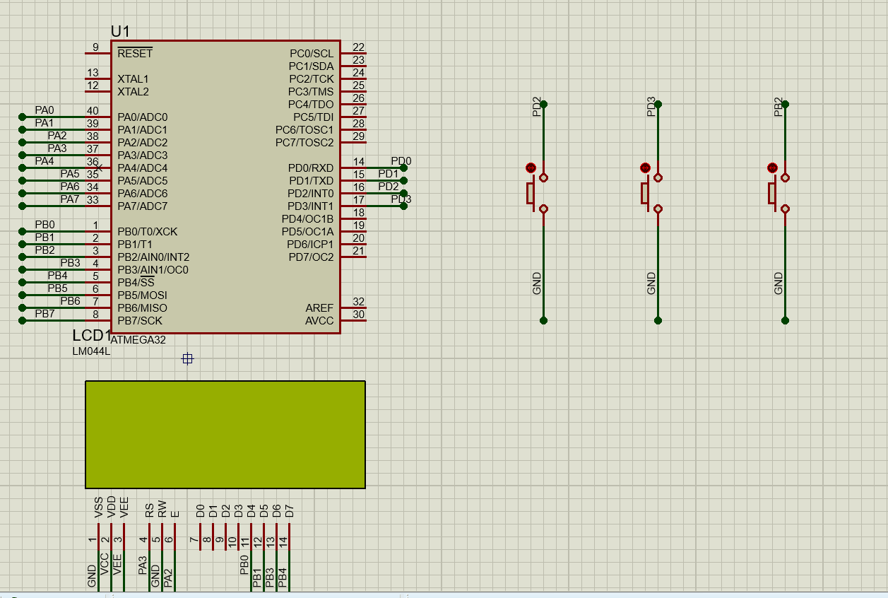

# Interfacing - EXTI 

## Q:  Write The EXTI Driver

### Example 
- Delays in ISR **Just** for testing.
- LIB 
	- BIT_MATH
	- STD_TYPES
- Driver Prerequisites 
	- DIO Driver to set the state of interrupt pin to input
```C
u8 Global_Var ;
void main(void)
{
	// GPIO Init 	
	// PINA0 Input-Pull Up
	dio_vidConfigChannel(DIO_PORTD,DIO_PIN2,INPUT);
	dio_vidConfigChannel(DIO_PORTD,DIO_PIN3,INPUT);
	dio_vidConfigChannel(DIO_PORTB,DIO_PIN2,INPUT);
	
	
	dio_vidEnablePullUp(DIO_PORTD,DIO_PIN2);
	dio_vidEnablePullUp(DIO_PORTD,DIO_PIN3);
	dio_vidEnablePullUp(DIO_PORTB,DIO_PIN2);
	// LCD Init
	lcd_vidInit();

	EXT_Init(int0 ,falling); 
	EXT_Init(int1 ,falling); 
	EXT_Init(int2 ,falling); 
	lcd_vidDisplyStr((u8*)"IRQ Initialized >>>>"); 
	Global_Int(enable);
	while(1)
	{
		if(Global_Var)
		{
			lcd_vidClrDislay();
			lcd_vidDisplyStr((u8*)"Welcome to Main -- "); 
			Global_Var = 0 ; 
		}
	}
}

ISR(INT0_vect)
{
	lcd_vidClrDislay();
	Global_Var = 1 ;
	lcd_vidDisplyStr((u8*)"Welcome to INT0 -- "); 
	_delay_ms(1000);

}
ISR(INT1_vect)
{

	lcd_vidClrDislay();
	Global_Var = 1 ;
	lcd_vidDisplyStr((u8*)"Welcome to INT1 -- "); 
	_delay_ms(1000);
	
}
ISR(INT2_vect)
{
	lcd_vidClrDislay();
	Global_Var = 1 ;
	lcd_vidDisplyStr((u8*)"Welcome to INT2 -- "); 
	_delay_ms(1000);
	
}
```

Result 

  


 ## *Contributing*  
Bug reports, feature requests, and so on are always welcome. Feel free to leave a note in the Issues section.