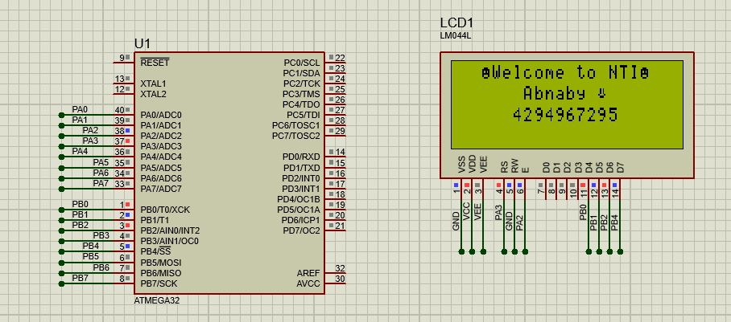

# Interfacing - LCD 

## Q:  Complete the function Named `lcd_vidDisplayNumbers(u32)` 


```C
int main(void)
{  
    // LCD Init
	lcd_vidInit();	
    // Change Cursor Position
	lcd_vidGotoRowColumn(0,2);
    // Display Custom Character 
	lcd_vidDisplyChar(0x02); 
    // Display String
	lcd_vidDisplyStr((u8*)"Welcome to NTI"); 
    // Display Custom Character 
	lcd_vidDisplyChar(0x02); 
    // Change Cursor Position
	lcd_vidGotoRowColumn(1,6);
    // Display String
	lcd_vidDisplyStr((u8*)"Abnaby ");
    // Display Custom Character 
	lcd_vidDisplyChar(0x01); 
    // Change Cursor Position
	lcd_vidGotoRowColumn(2,5);
    // Display Number
	lcd_vidDisplayNumbers(4294967295);
		
    while (1) 
    {
	
    }
}


```

Result 

  


 ## *Contributing*  
Bug reports, feature requests, and so on are always welcome. Feel free to leave a note in the Issues section.