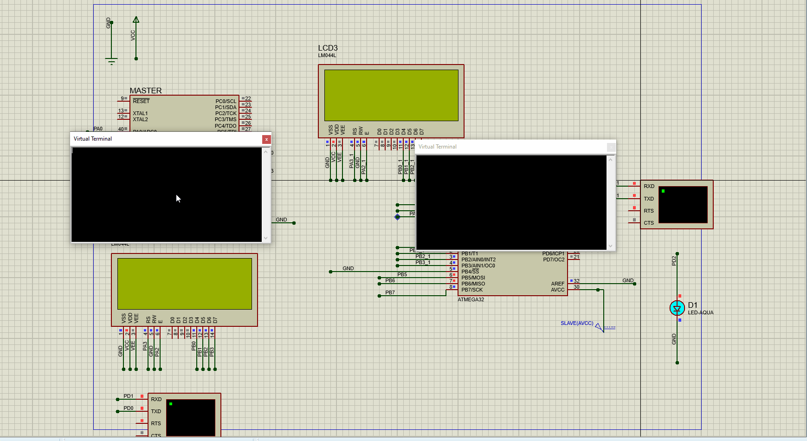

# Interfacing - Chatting System Using SPI 

Implement Chatting System between two MCUs through SPI by providing UART interfacing in each MCU with PC

Result 

  

 ## *Contributing*  
Bug reports, feature requests, and so on are always welcome. Feel free to leave a note in the Issues section.