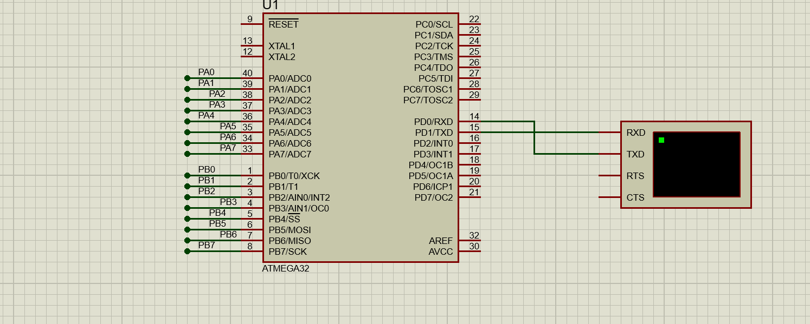
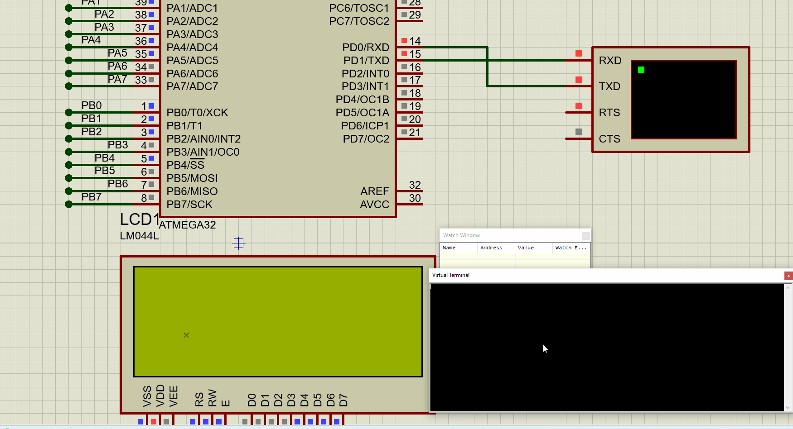

# Interfacing - UART 

## Q1:  Complete the function Named `UART_voidTransmitStringAsynch()` 

### Example
```C

void TX_Complete(void)
{
	UART_TransmitString("\r\nTX_COMPLETE");
}

int main(void)
{
	// UART Init
	dio_vidConfigChannel(DIO_PORTD,DIO_PIN1,OUTPUT);
	UART_Init(UART_BAUDRATE_9600);
	u8 LOC_u8Buffer[] = {"\r\nHello World \r\n\0"};
	sei();
	UART_voidTransmitStringAsynch(LOC_u8Buffer, TX_Complete) ; 
	 
    while (1) 
    {
		// Externally Pulled Down
		if(dio_dioLevelReadChannel(DIO_PORTA,DIO_PIN0) == STD_LOW)
			dio_vidFlipChannel(DIO_PORTA,DIO_PIN2); 
		// Every 10 ms
		_delay_ms(1000);
		UART_voidTransmitStringAsynch(LOC_u8Buffer, TX_Complete) ; 
    }
}
```

Result 

  

## Q2:  Complete the function Named `UART_ReceiveStringAsynch(P2F)` 


### Example

Configurations 
```c
// In File Called uart.h Write Down Received Buffer Size
#define MAX_BUFFER_SIZE	10

// Determine End charcter of string 0x0D = 13 = '\n'
#define UART_RX_ENDING_CHAR	13
```
```C
void RX_CompleteString(u8 *ptrBuffer , u8 BufferSize)
{
	lcd_vidClrDislay();
	lcd_vidDisplyStr((u8*)"Received String -- "); 
	lcd_vidGotoRowColumn(1,4);	
	lcd_vidDisplyStr((u8*)ptrBuffer); 
}
int main(void)
{
	// LCD Init
	lcd_vidInit();
	// UART Init
	dio_vidConfigChannel(DIO_PORTD,DIO_PIN1,OUTPUT);
	UART_Init(UART_BAUDRATE_9600);
	// Call Asynch Function
	UART_ReceiveStringAsynch(RX_CompleteString);
	sei();
    while (1) 
    {
		__asm("NOP");
    }
}

```
Result 

  

 ## *Contributing*  
Bug reports, feature requests, and so on are always welcome. Feel free to leave a note in the Issues section.